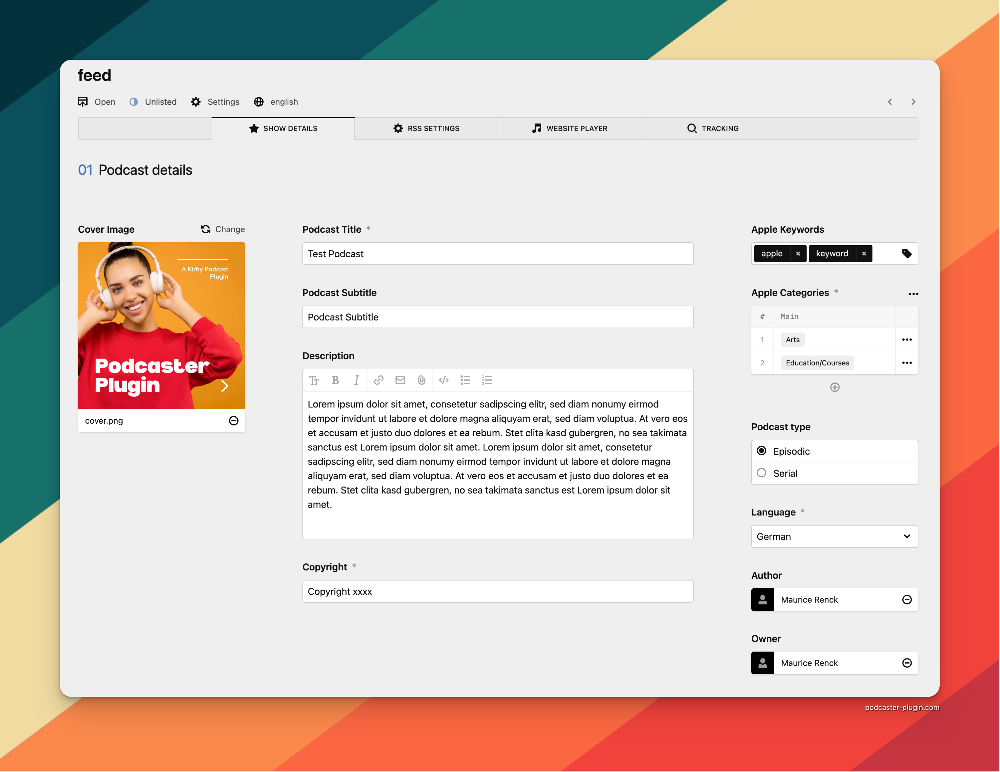

# Setup
This plugin comes with a blueprint and template for the RSS feed. In addition you may need a template for the episode listing on your website.

## How to structure your Podcast
In order to configure the feed correctly, you first have to think how you would like to structure the pages of your Podcast.

There are three recommended ways to structure your Podcast (but you can do it however you like): 
1. Flat
2. By Season
3. By Year

### 1. Flat
This structure is the simplest but may become a bit cluttered over time. In this case you have a flat structure with the feed and the episode on one level:

- My Podcast
	- feed
	- episode01
	- episode02
	- (…)

### 2. By season
This structure might be the best one for most Podcasts. In this case you have a deeper structure splitter into seasons with the feed and the season pages on one level and the episode as children of the season pages:

- My Podcast
	- feed
	- season 01
		- episode 01
		- episode 02
		- (…)
	- season 02
		- episode 01
		- (…)

### 3. By year
This structure works the same as the seasonal one, but it is splitter by year with the feed and the yearly pages on one level and the episodes as children of the yearly pages:

- My Podcast
	- feed
	- 2023
		- episode 01
		- episode 02
		- (…)
	- 2024
		- episode 01
		- (…)


## Create the feed
It is recommended to create a parent page for all the pages of your Podcast. I will call it „My Podcast“ in this example. This page should have a blueprint/template which can later on list all episodes.

Create the feed page within your Podcast page:

1. Open the Podcast page (My Podcast)
2. Create a new draft
3. Select `Podcaster Feed` as a template
4. Create the page


> [!NOTE]()
> If you cannot see the template `Podcaster Feed` make sure
> - The plugin is correctly installed
> - The blueprint of the parent page allows to create pages with the `podcasterfeed` template.

If everything worked, you should the feed page, it should look like this:



Fill in at least the:
- Podcast Title
- Copyright
- Apple Categories
- Language

Switch to the `RSS Settings` tab and fill out:
- Podcast Id
- Link

The `Podcast ID` should be a simple string, representing our Podcasts name. For example `my-podcast`

The Podcast Link should be a link to the landing page of your Podcast.

Next
- save the changes and ignore that the required `Source Pages` are empty for now.
- fill all the other fields as you like (link zu allen Feldern und was sie machen)
- set the page status to unlisted
- open the page - you should see the rss feed with all the information you entered


## Creating Episodes
This plugin does not provide a blueprint for episodes but it does provide a tab blueprint to extend your existing blueprints.

### Prepare a blueprint
If you have a blog your could extend your post blueprint. If you don’t have any fitting blueprint, you can use this very simple example:

```yaml
title: Episode
num: '{{ page.date.toDate("YmdHi") }}'
tabs:
  podcast:
    extends: tabs/podcasterepisode
  content:
    sections:
      basic_stuff:
        type: fields
        fields:
          date:
            label: Date
            type: date
            default: today
            required: true
          text:
            label: Text
            type: textarea
            size: large
```

If you do have a fitting template, you can extend it with:

```yaml
tabs:
  podcast:
    extends: tabs/podcasterepisode
```

### Create an episode
Create an episode within your chose structure. I’ll use the seasonal structure in the example. So I will

1. Open the panel
2. Go to the `My Podcast` page
3. Create a child page named `Season 01` with the same listing template used by `My Podcast`
4. Go into `Season 01`
5. Create a new page with my episode template

The newly created page should look like this:


Now fill in at least the required fields:
- Upload the mp3 file
- Chose an episode type
- Fill out all the fields to your liking 

Publish the episode page **and** the season page.

### Add episodes to the feed
Now we can add episodes to the feed:
1. Open the panel
2. Go to your podcast
3. Open the feed
4. Go to RSS Settings
5. Edit `Source Pages`
6. Add the page containing your episodes, in my case this is `Season 01`
7. Save the changes
8. Open the page

You should now see the new episode in the RSS feed.

### Publishing the Podcast
You are set up now and can publish the RSS feed. If your feed is still a draft:

1. Open the panel
2. Go to your podcast
3. Set the feed page to unlisted
4. Open the feed
5. Copy the URL
6. Submit the URL to the directories of your choice

**Congratulations! Your Podcast is live!**

> [!NOTE]()
> Go ahead and start configuring [Podcaster Analytics][3] to see how many people are listing to your Podcasts.

[3]:	analytics.md